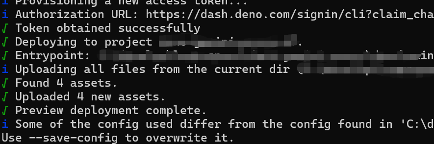

# Deno Gemini Proxy

这是一个基于 Deno 的 Gemini API 代理服务，可以部署到 Deno Deploy 平台。

## 功能特性

- 转发 Gemini API 请求到 Google 官方 API
- 提供健康检查端点
- 支持所有 Gemini API 端点

## 本地开发

### 前置要求

确保已安装 Deno：

```bash
# 在 Linux/macOS 上安装 Deno
curl -fsSL https://deno.land/install.sh | sh

# 在 Windows 上安装 Deno (使用 PowerShell)
irm https://deno.land/install.ps1 | iex
```

### 运行服务

```bash
deno run --allow-net  main.ts
```

服务将在 http://localhost:8000 启动。

### 测试端点

```bash
# 测试健康检查
curl http://localhost:8000/health

# 测试 API 转发（需要有效的 API Key）
curl -X POST http://localhost:8000/v1beta/models/gemini-2.5-flash:generateContent \
  -H "Content-Type: application/json" \
  -H "x-goog-api-key: YOUR_API_KEY" \
  -d '{"contents":[{"parts":[{"text":"Hello"}]}]}'
```

## 部署到 Deno Deploy

### 方法 1: 使用 deployctl CLI

1. 安装 deployctl：
```bash
deno install -gArf jsr:@deno/deployctl
```
2. 进入本项目目录所在的deno文件夹
3. 运行部署脚本(不要忘记为deployctl添加环境变量)
```bash
deployctl deploy
```
4. 假如成功,你会看到以下结果
 


### 方法 2: 通过 GitHub 集成

1. 将代码推送到 GitHub 仓库
2. 访问 [Deno Deploy](https://dash.deno.com/)
3. 创建一个新项目
4. 连接 GitHub 仓库
5. 设置入口文件为 `main.ts`
6. 部署完成


## 使用方法

部署完成后，您将获得一个类似 `https://your-project.deno.dev` 的 URL。
将此URL添加到你的Gemini-Api-key-Aggregator的配置中即可。

## 许可证

MIT License
